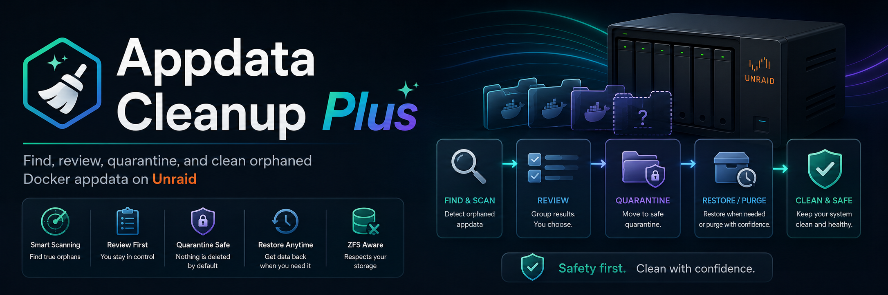

# Appdata Cleanup Plus

Appdata Cleanup Plus is an Unraid plugin that finds orphaned appdata folders left behind by removed Docker containers, lets you review the candidates, and then quarantine or delete only what you explicitly select.

## Requirements

- Unraid `7.0.0+`
- Docker templates in `/boot/config/plugins/dockerMan/templates-user/`
- Manual review before any destructive action

## What It Scans

- Saved Docker template paths
- Installed container volume mappings when Docker is online
- Existing candidate folders only

If Docker is offline, the plugin still shows candidates from saved templates, but those results should be reviewed more carefully because active container mappings cannot be verified.

## Main Features

- Compact review dashboard built for Unraid Settings
- Search, sorting, risk filtering, and ignored-path visibility
- Folder size and last-updated metadata in the results list
- Split mode strip with inline quarantine manager access
- Quarantine manager with restore and purge actions
- Full audit history panel for cleanup, restore, and purge activity
- Ignore and restore actions for paths you do not want surfaced again
- Dry run mode for the current selected action
- Quarantine as the default real action
- Optional permanent delete mode when you explicitly enable it
- Session-scoped action snapshots and cached path statistics

## Safety Model

- Default action is `Quarantine selected`, not permanent delete
- `Dry run` previews the current action without changing anything
- Outside-share candidates are locked until `Allow outside-share cleanup` is enabled
- Permanent delete is locked until `Enable permanent delete` is enabled
- Actions run from a server-side scan snapshot using candidate ids, not client-posted paths
- CSRF validation is required for plugin actions
- Share roots, mount points, symlinked paths, and unsafe filesystem targets are blocked
- Native recursive delete checks folder contents before removal instead of shelling straight to `rm -rf`

## Install

Stable `main` channel:

```bash
plugin install https://raw.githubusercontent.com/alexphillips-dev/Appdata-Cleanup-Plus/main/plugins/appdata.cleanup.plus.plg
```

Dev `testing` channel:

```bash
plugin install https://raw.githubusercontent.com/alexphillips-dev/Appdata-Cleanup-Plus/dev/plugins/appdata.cleanup.plus.plg
```

CA XML:

```text
https://raw.githubusercontent.com/alexphillips-dev/Appdata-Cleanup-Plus/main/appdata.cleanup.plus.xml
```

Cache-busting install pattern:

```text
https://raw.githubusercontent.com/alexphillips-dev/Appdata-Cleanup-Plus/<commit>/plugins/appdata.cleanup.plus.plg
```

## Quick Use

1. Open `Settings` -> `Appdata Cleanup Plus`.
2. Review the detected folders, size, age, and flag reason.
3. Use `Dry run` to preview the current action.
4. Leave permanent delete off unless you intentionally want irreversible removal.
5. Use `Quarantine selected` or `Delete selected` only after checking every path.

## Safety Settings

- `Allow outside-share cleanup`: unlocks review candidates that sit outside the configured appdata share
- `Enable permanent delete`: switches the primary action from quarantine to permanent delete
- `Show ignored`: reveals paths hidden by your ignore list so they can be restored

## Stored Plugin State

The plugin stores its runtime data under:

```text
/boot/config/plugins/appdata.cleanup.plus/
```

Important files:

- `ignored-paths.json`: hidden candidates
- `cleanup-audit.jsonl`: cleanup and quarantine audit log
- `safety-settings.json`: saved safety toggles
- `snapshots/`: session-scoped action snapshots
- `path-stats-cache.json`: cached size and mtime lookups
- `quarantine-records.json`: tracked quarantine entries

Default quarantine root:

- inside the configured appdata share when available: `/.appdata-cleanup-plus-quarantine`
- otherwise: `/mnt/user/system/.appdata-cleanup-plus-quarantine`

## Compatibility Notes

- Appdata Cleanup Plus no longer depends on the Community Applications helper runtime
- Stable `main` builds point to `main` metadata and archives
- Testing `dev` builds point to `dev` metadata and archives
- Package versions use `YYYY.MM.DD.UU` so same-day updates sort correctly in Unraid

## Maintainer Commands

Build package and refresh manifest/XML metadata:

```bash
bash pkg_build.sh
```

Preview the next computed package version without writing release files:

```bash
bash pkg_build.sh --dry-run
```

Validate manifest, CA metadata, archive, and branch URLs:

```bash
bash scripts/release_guard.sh
```

Run the local backend behavior smoke tests:

```bash
bash scripts/test_behavior.sh
```

After promoting `main`, sync release artifacts back into `dev` while restoring `dev` feed URLs:

```bash
bash scripts/sync_main_to_dev.sh
```

## Repo Layout

- `plugins/appdata.cleanup.plus.plg`: Unraid plugin manifest
- `appdata.cleanup.plus.xml`: CA metadata template
- `source/appdata.cleanup.plus/`: packaged plugin source
- `archive/`: built `.txz` packages
- `docs/images/`: repository documentation images

## Support

- Forum support thread: `https://forums.unraid.net/topic/197975-plugin-appdata-cleanup-plus/`
- Repo: `https://github.com/alexphillips-dev/Appdata-Cleanup-Plus`
- Issues: `https://github.com/alexphillips-dev/Appdata-Cleanup-Plus/issues`
